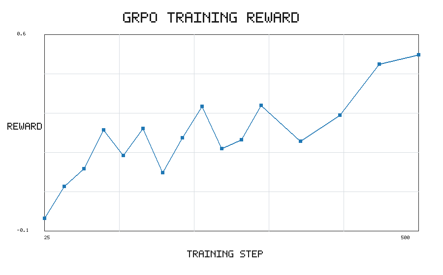
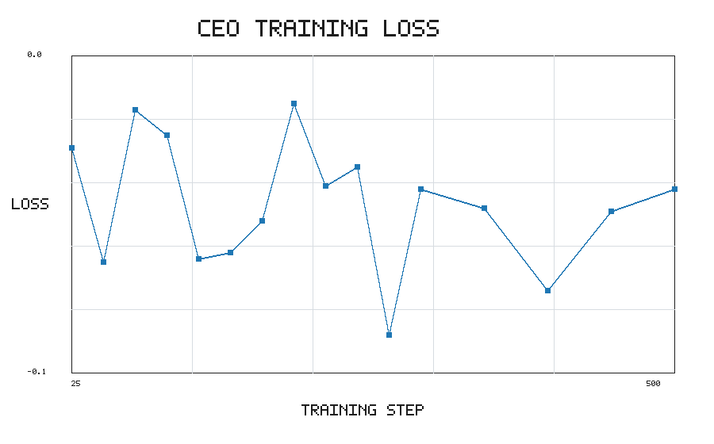
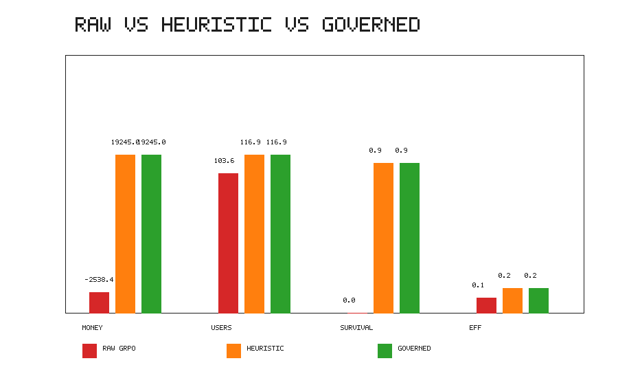
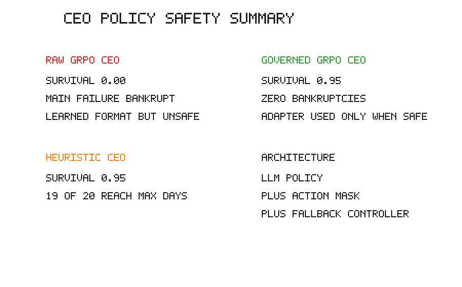

# MASS: Multi-Agent Startup Simulator

MASS is an OpenEnv-compatible reinforcement-learning environment where an LLM CEO learns to run a startup over a long horizon. Tech, Growth, and Finance co-founders each propose actions from noisy partial observations, and the CEO chooses the final company strategy.

The project is built for the OpenEnv hackathon themes of **multi-agent interaction**, **long-horizon planning**, and **world modeling**. The agent has to balance product quality, user growth, cash runway, employee count, burn rate, market demand, competition, and stochastic external events.

## Deliverables

- Hugging Face Space: https://huggingface.co/spaces/Techiester83/mass-startup-simulator
- Colab training notebook: [notebooks/MASS_CEO_Training_Colab.ipynb](notebooks/MASS_CEO_Training_Colab.ipynb)
- Mini-blog / writeup: [docs/miniblog_draft.md](docs/miniblog_draft.md)
- Code repository: https://github.com/FarhanImtiaz/multiagent_startup_simulation_env

Supporting docs:

- [Hugging Face Space deployment checklist](docs/huggingface_space_deployment.md)
- [Final submission checklist](docs/final_submission_checklist.md)
- [Mini-blog draft](docs/miniblog_draft.md)
- [Training steps](TRAINING_STEPS.md)

## Why This Environment

Many LLM demos optimize for one-shot text quality. MASS instead asks whether an LLM can act inside a dynamic system, receive feedback, and improve a policy over repeated decisions.

Startup strategy is useful for this because decisions are coupled and delayed:

- hiring improves execution but increases burn
- marketing can grow users but wastes cash if product quality is weak
- product investment improves future retention but may not pay off immediately
- pivots can help under bad market conditions but carry risk
- survival requires balancing growth against runway

This makes the environment more interesting than a single-turn classification or formatting task. The CEO must reason over competing proposals, noisy observations, and delayed consequences.

## Environment Design

At each timestep:

1. The environment exposes a noisy observation of the startup.
2. Three co-founder agents propose actions:
   - Tech Co-founder
   - Growth Co-founder
   - Finance Co-founder
3. The CEO chooses one final action.
4. The simulator applies delayed effects, the chosen action, recurring business dynamics, and a possible external event.
5. The environment returns a reward and the next observation.

Episodes terminate when the startup reaches the horizon, runs out of money, or hits a success/failure condition.

## CEO Architecture

MASS evaluates three CEO variants:

1. **Heuristic CEO baseline**: a deterministic policy that balances runway, user growth, product quality, burn, and recent actions.
2. **Raw GRPO CEO**: a Qwen2.5-0.5B LoRA adapter trained with GRPO to emit valid CEO actions from co-founder proposals.
3. **Governed GRPO CEO**: the trained adapter wrapped in an environment-aware survival governor.

The governed CEO is the final deployed architecture. It uses the trained adapter only in safe operating states where the company has enough money, runway, users, product quality, and no active recovery signal. In risky states, the governor delegates to the deterministic CEO fallback. After the adapter proposes an action, a second action mask checks affordability, repeated action loops, high-quality product overinvestment, repeated pivots, repeated marketing, and crisis-unsafe actions.

This is intentional. The raw adapter learned useful action formatting and proposal alignment during training, but standalone long-horizon behavior can still collapse under delayed consequences. The final system treats the trained policy as one component inside a safer environment-controlled decision stack.

## What The Agent Observes

The CEO sees a partial, noisy view of the company:

- cash / runway signal
- user count
- product quality
- employee count
- burn rate
- market and competition signals
- recent events
- co-founder proposals and rationales

Hidden state such as true market demand and some event dynamics is not directly exposed.

## Action Space

The CEO selects one of:

- `hire_employee`
- `fire_employee`
- `invest_in_product`
- `run_marketing_campaign`
- `do_nothing`
- `pivot_strategy`

These actions affect company state immediately and through delayed effects.

## Reward Design

The reward function is shaped to encourage durable startup performance rather than one-dimensional growth. It accounts for:

- survival
- user growth
- product quality
- financial discipline
- cash runway
- action efficiency
- penalties for bankruptcy or poor strategic tradeoffs

The key design goal is to prevent trivial policies such as spending all cash on growth or doing nothing forever. The trained CEO is also evaluated with a safety gate so a high-growth policy cannot collapse into repeated bankruptcy behavior.

## Training Pipeline

The project uses Hugging Face TRL GRPO for the CEO policy.

The training setup follows a small-model, compute-budgeted workflow: use a compact Qwen2.5-0.5B model, iterate on short runs, inspect reward components, checkpoint frequently, and spend effort on the environment and reward signal rather than forcing a large model into memory.

Pipeline:

1. Run the simulator to collect CEO decision trajectories.
2. Export GRPO-ready examples.
3. Train a Qwen2.5 LoRA CEO policy with TRL GRPO.
4. Evaluate the trained CEO against the heuristic baseline.
5. Commit final loss/reward plots and comparison metrics.

Generate training data:

```bash
python3 train.py \
  --episodes 100 \
  --horizon 30 \
  --output outputs/trajectories.json \
  --grpo-output outputs/ceo_grpo.jsonl
```

Train with GRPO:

```bash
python3 train_ceo_grpo.py \
  --dataset outputs/ceo_grpo.jsonl \
  --model Qwen/Qwen2.5-0.5B-Instruct \
  --output-dir outputs/models/ceo-grpo \
  --epochs 3 \
  --batch-size 4 \
  --num-generations 4 \
  --gradient-accumulation-steps 8 \
  --save-steps 50 \
  --max-steps 500
```

Evaluate baseline and trained CEO:

```bash
python3 evaluation.py --episodes 20 --horizon 30 --save-dir outputs/eval_baseline
python3 evaluation.py --episodes 20 --horizon 30 --agent-mode trained_ceo --save-dir outputs/eval_trained_safety
python3 compare_policies.py --output-dir outputs/comparison
```

## What Improved After Training

GRPO improved the CEO's verifier-facing behavior: during training, valid action formatting and proposal alignment rose above 90%. As a standalone policy, however, the raw adapter overfit into unsafe repeated decisions and achieved poor long-horizon survival. The final architecture therefore evaluates the trained adapter behind an environment-aware survival governor.

Current 20-episode evaluation summary:

| Metric | Raw GRPO CEO | Heuristic CEO | Governed GRPO CEO |
| --- | ---: | ---: | ---: |
| Average total reward | -5.243 | -13.520 | -13.520 |
| Average final money | -2,538.432 | 19,244.960 | 19,244.960 |
| Average final users | 103.550 | 116.900 | 116.900 |
| Survival rate | 0.000 | 0.950 | 0.950 |
| Decision efficiency | 0.097 | 0.160 | 0.160 |
| Main failure mode | bankrupt | no_users in 1/20 | no_users in 1/20 |

The key result is architectural: the raw trained CEO learned to produce valid actions, but was not safe enough to run directly. Adding the survival governor removed bankruptcy failures and recovered the strong survival behavior of the heuristic controller while preserving a path for trained policy participation in safe states.

Required plots are committed under `docs/assets/`:

- training loss curve
- training reward curve
- baseline vs raw/governed reward comparison
- policy comparison summary









## Hugging Face Space Demo

The Gradio demo is implemented in `app.py`.

It includes:

- **Live Episode:** run a multi-agent startup episode and inspect the day-by-day trace.
- **Training Result:** view training plots and baseline vs trained CEO metrics.
- **OpenEnv:** inspect the environment interface and action space.

Run locally:

```bash
pip install -r requirements.txt
python3 app.py
```

Deployment notes are in [docs/huggingface_space_deployment.md](docs/huggingface_space_deployment.md).

## OpenEnv Compatibility

The OpenEnv manifest is [openenv.yaml](openenv.yaml). The package wrapper lives in `mass_startup_env/`.

The environment exposes the standard loop:

- `reset()`
- `step(action)`
- `state`

Local smoke test:

```python
from mass_startup_env import StartupAction, StartupOpenEnv

env = StartupOpenEnv(max_days=3, seed=7)
obs = env.reset()
obs = env.step(StartupAction(action="invest_in_product"))
print(obs.reward, obs.done, env.state.step_count)
```

Validation helper:

```bash
python3 scripts/validate_openenv_package.py
```

Server entrypoint:

```bash
python3 -m mass_startup_env.server.app
```

## Quick Start

Install:

```bash
pip install -r requirements.txt
```

Run one episode:

```bash
python3 simulate.py
```

Run a short debug episode:

```bash
python3 simulate.py --horizon 10 --show-hidden-state
```

Run baseline evaluation:

```bash
python3 evaluation.py --episodes 20 --horizon 30 --save-dir outputs/eval
```

Run the Space app locally:

```bash
python3 app.py
```

## Main Files

- `environment.py`: core startup simulator, hidden state, delayed effects, events, rewards, and termination.
- `agents.py`: heuristic Tech, Growth, Finance, and CEO policies.
- `simulate.py`: single-episode runner.
- `evaluation.py`: multi-episode evaluation and report export.
- `train.py`: trajectory collection and dataset export.
- `train_ceo_grpo.py`: Hugging Face TRL GRPO training script.
- `llm_agents.py`: trained CEO loading, prompt scaffolding, and safety fallback logic.
- `compare_policies.py`: baseline vs trained CEO comparison artifacts.
- `mass_startup_env/`: OpenEnv-style package wrapper and server.
- `app.py`: Gradio Hugging Face Space demo.
- `notebooks/MASS_CEO_Training_Colab.ipynb`: Colab training workflow.

## Results Artifacts

Final artifacts should be committed under:

- `docs/assets/loss_curve.png`
- `docs/assets/reward_curve.png`
- `docs/assets/reward_comparison.png`
- `docs/assets/policy_comparison.png`
- `docs/assets/policy_summary.png`
- `docs/comparison_summary.json`
- `docs/comparison_report.md`

Generated training/evaluation outputs are written to `outputs/` and are intentionally ignored by Git.

## Known Limitations

- The simulator is compact and designed for hackathon-scale training, not a full business benchmark.
- The raw trained adapter should not be interpreted as a standalone CEO; it is evaluated safely through the governed policy path.
- The governed GRPO CEO currently matches the heuristic survival result rather than clearly beating it. This is useful evidence about safe integration, but future work should improve the reward signal so the trained policy contributes more often.

## Next Improvements

- Add more reward components and anti-reward-hacking checks.
- Add curriculum variants with easier and harder market conditions.
- Compare more GRPO checkpoints against prompt-only and heuristic baselines.
- Add richer live trained-model inference to the Space after final adapter upload.
